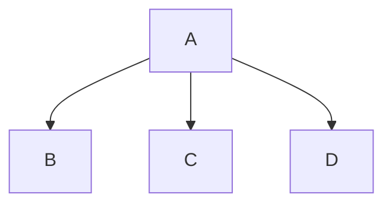
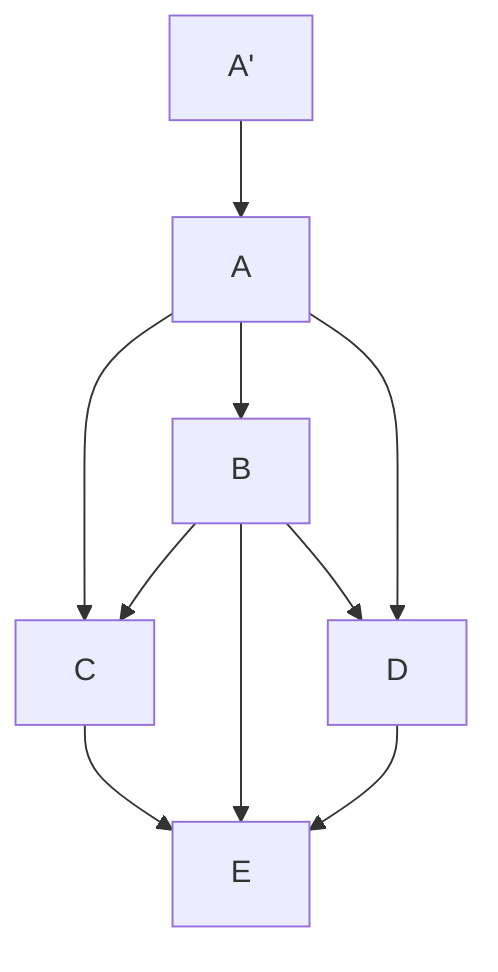

# dotConfigFiles4Share

> [!NOTE] 
> 常用软件的配置文件分享以及配置详解

## 为什么构建这样的仓库

对于日常使用的软件和工作中使用的软件的配置文件，在绝大多数情况下是东拼西凑的，或是从旧的项目进行复制粘贴的。

理想状态下的项目复制来源如下所示：

理想情况下，A 是最纯净的配置来源，B、C、D 的配置均来自 A 的配置，但是，随着时间的积累，某个项目的复制来源可能混乱不堪，甚至最开始的 A 的配置由于业务的变更改动也变得混乱不堪，导致某个项目 E 的来源有可能如下所示：

更严重的情况下，哪怕来源如图 1 所示的皆从 A 复制而来，但是 A 配置的部分内容，可能是由于网络上的随意粘贴、复制而来，并没有人清楚具体的配置的影响和作用，所以，将配置的注释与实际作用一同写入配置文件中，方便后续的复制使用。

## 仓库状态

## 其余的仓库

|   仓库命名   |  仓库作用  |                访问地址                 | 仓库状态 | 维护情况 |        是否开源        |
|:--------:|:------:|:-----------------------------------:|:----:|:----:|:------------------:|
| utils-sh | 常用脚本仓库 | https://github.com/J1nH4ng/utils-sh | 进行中  | 长期维护 | :white_check_mark: |